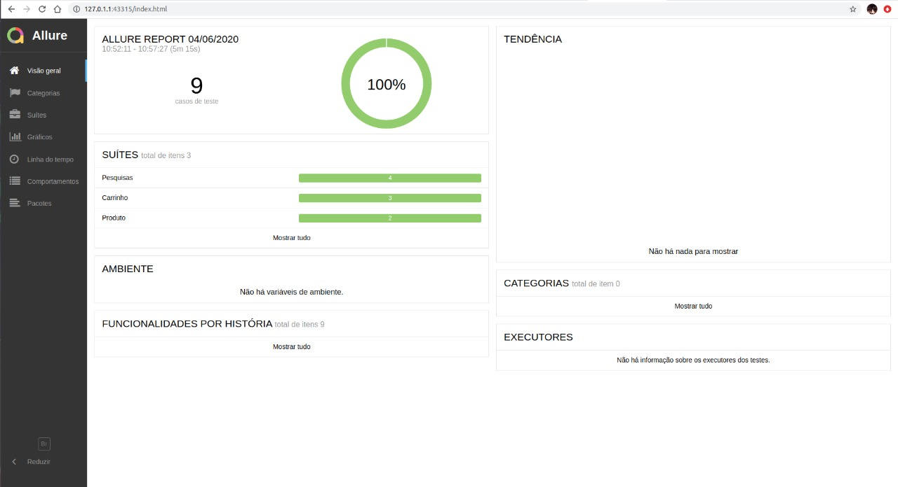
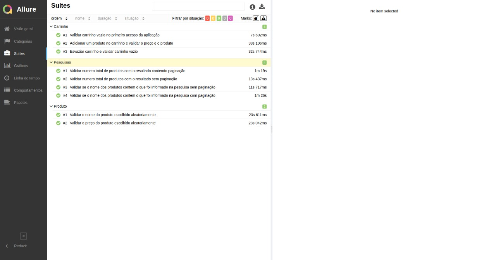
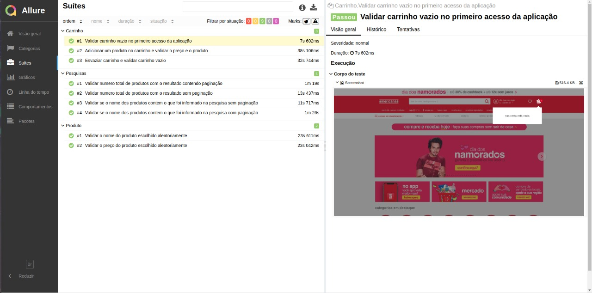

# desafioZup

* [Descrição](#descrição)
* [Iniciando](#iniciando)
* [Desenvolvimento](#desenvolvimento)
* [Construção](#construção)
* [Configuração](#configuração)

## Descrição

O presente projeto foi elaborado atendendo ao desafio proposto durante o processo de seleção da empresa Zup, que visa a contratação para o cargo de Analista de Testes Automatizados (QA). Tal desafio consistiu no desenvolvimento de uma automação que validasse alguns cenários de teste em um site de varejo de livre escolha. Sendo assim, o projeto focou em elaborar testes no portal de comércio online www.americanas.com, os quais foram realizados com auxílio do framework de testes **Protractor**, responsável pela automação, juntamente com o **Allure Report**, cujo papel foi gerar relatórios. Siga as considerações contidas neste documento para visualizar o trabalho.

## Iniciando

Para executar o projeto, será necessário instalar os seguintes programas:
- [npm (Gerenciador de Pacotes Node): Necessário para para baixar o protractor e o webdriver-manager.](https://www.npmjs.com/get-npm)

Tendo executado o **npm**, efetue o comando abaixo para a instalação do **webdriver-maneger** e o framework **protractor** :
```shell
npm install -g protractor
```
O **webdriver-manager**, que nada mais é do que um gerenciador de instâncias do selenium server. Para baixar ou atualizar os drivers do selenium é preciso executar a seguinte linha de comando:
```shell
webdriver-manager update
```

## Desenvolvimento
Para executar a automação, é apenas necessário que se clone o projeto do GitHub num diretório de sua preferência. Utilize: 

```shell
cd "diretorio de sua preferencia"
git clone https://github.com/janioamorimjunior/desafioZup.git
```

## Construção
Após a clonagem, será necessário instalar as dependências do projeto com o comando:

```shell
npm install
```
Dessa forma, serão baixadas as dependências necessárias para a execução limpa da automação.

## Configuração
Tendo em vista que não é necessário nenhum IDE (ambiente de desenvolvimento), a configuração necessária para a execução da automação tão somente exige que abra-se o terminal na raiz do projeto e execute o comando a seguir:

```shell
protractor
```

Quando os testes forem finalizados, é possível visualizar os resultados em um relatório executando o comando:

```shell
allure serve
```
Feito isso, uma janela será aberta no localHost exibindo a tela inicial do allure contendo as suites de teste (conjunto de casos de teste) feitas e seus respectivos gráficos.

<div align="center">
    
    <p>Página inicial do Allure.</p>
</div>

Ao clicar nas suítes será mostrado a tela que vai conter as suítes de teste, juntas com seus casos de teste e estes podem possuir evidências sobre a execução

<div align="center">
	
    <p>Suites de teste</p>
    
    <p>Caso de teste com evidência</p>
</div>
